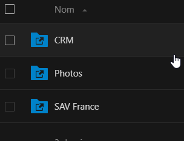

# <center>LciFilesManager</center>

## 1/ Presentation :

Ce projet permet de récupérer les sites depuis le crm divalto et de créer des dossiers correspondant dans un ou plusieurs servers, dans un ou plusieurs dossiers.


## 2/ Instalation :

### Après avoir récupéré le projet :

1 => Pour installer les dependences requise :

```php bin/console composer install```

2 => Pour créer la base de données (Édité la variable dans le .env au besoin) :

```php bin/console d:d:c```

3 => Pour faire les migrations (générer les tables) :

```php bin/console d:m:m```


## Utilisation (info SRV: Z:\AUTOMATISME\$ - PROJETS ----\CRM\InfoLciFilesManager.md) :

1 => créer des servers :

/!\ Le nom du serveur doit correspondre au nom du Server (sensible a la Case) sur nextcloud (Pour que les urls générer et envoyer a divalto corresponde) /!\



```php bin/console create:server```

2 => créer des emplacements de dossier :

/!\ Le Path represente le chemin de base ou sera creer les dossier dans le serveur (voir avec administrateur) /!\

```php bin/console create:folder```

3 => Une fois que vous avez configuré des servers et dossiers, lancer cette commande pour générer les dossiers correspondant aux sites du crm :

```php bin/console get:crmsites```

3 => nettoyer la base de données (les dossiers créer sont a supprimer manuellement) :

```php bin/console clear:crmsites```

## Todo :

- ajout d'une crontab pour lancer le script régulièrement

- Une fois d'accord sur l'architecture des dossiers et que divalto aura devolopper les champs pour les emplacements de dossiers :
=> finaliser la méthode d'envoi d'url


